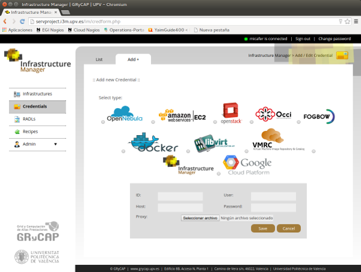
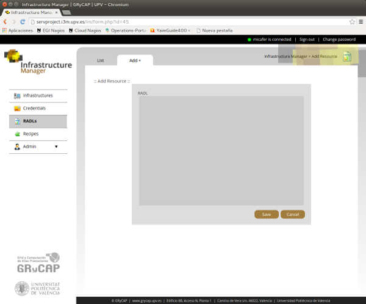
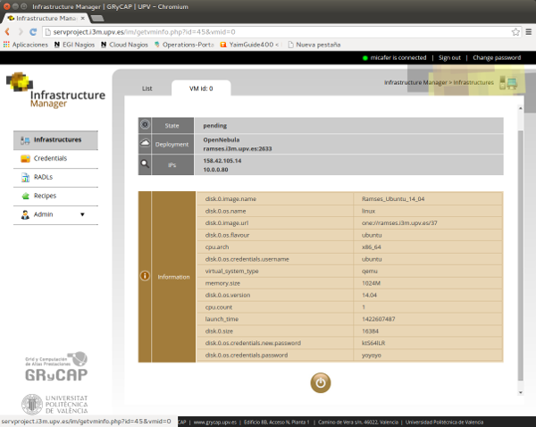

IM Web Interface
================

The IM Web client is a graphical interface to access the XML-RPC API of IM Server.

Prerequisites
-------------
As a web application it needs a web server (e.g. Apache) with support to PHP language
and with the SQLite D.B. support. It must have access to the XML-RPC API of the IM Server.

Configuration
-------------

The web interface reads the configuration from :file:`$IM_WEB_PATH/config.php`. It has 
the following variables::

	$im_host="localhost";
	$im_port=8899;
	$im_db="/home/www-data/im.db";
	# To use that feature the IM recipes file must accesible to the web server
	#$recipes_db="/usr/local/im/contextualization/recipes_ansible.db";
	# If not set ""
	$recipes_db="";
	# To activate the EC3 functionality, currently unavailable
	$ec3=False;
	$ec3_path="/var/www/im/ec3";

Usage
-----
The web interface of the IM enables the user to manage all the aspects related with the 
management of the life-cycle of his virtual infrastructures. 

Register
^^^^^^^^
In the service deployed at http://servproject.i3m.upv.es/im whe a new user is registered
it automatically creates credentials to both of them to make easier the register process.

Credentials
^^^^^^^^^^^

The first step is to manage the credentials of the user to access all the components of the
platform, specially the Cloud providers. :ref:`Fig. 1 <figure_cred_list>` shows a list
of a user credentials. In this list there are two related with the IM components:
  * InfrastructureManager: user and password to access the IM service.
  * VMRC: user, password and URL to access the `VMRC <http://www.grycap.upv.es/vmrc>`_ service
The rest of elements of this list are the user credentials to access diferent Cloud providers.

.. _figure_cred_list:
.. figure:: images/cred_list.png

   Fig 1. List of credentials.

:ref:`Fig. 2 <figure_cred_add>` shows the form to add or edit the user credentials. The user must
select the type of the credentials using the selectors with the images of each type. Then he must
provide the needed data to access each Cloud provider.   

.. _figure_cred_add:   

   Fig 2. Add new credential.

Fields needed to access each Cloud provider:   

* ``username`` indicates the user name associated to the credential. In EC2 and
  OpenStack it refers to the *Access Key ID*.

* ``password`` indicates the password associated to the credential. In EC2 and
  OpenStack it refers to the *Secret Acess Key*.

* ``host`` indicates the address of the access point to the cloud provider.
  This field is not used in IM and EC2 credentials.
  
* ``proxy`` indicates the proxy file associated to the credential.
  
* ``project`` indicates the project name associated to the credential.
  This field is only used in the GCE plugin

* ``id`` associates an identifier to the credential. The identifier should be
  used as the label in the *deploy* section in the RADL.
   

RADLs
^^^^^

The RADL section enables to manage and share RADL documents with other users of the platform. 

.. figure:: images/radl_list.png

   List of RADL documents.
   
   
.. figure:: images/radl_edit.png

   Edit a RADL document and permissions.
   
.. figure:: images/radl_params.png

   Launch a parametric RADL.

Infrastructures
^^^^^^^^^^^^^^^

.. figure:: images/inf_list.png

   List of user infrastructures.
   
   

   Add new resources to a running infrastructure.
   
   
.. figure:: images/cttxt_log.png

   Contextualization log of the infrastructure.
   

   Information about a VM of the infrastructure.

Recipes
^^^^^^^

.. figure:: images/recipes_list.png

   List of recipes.
   
.. figure:: images/recipe_add.png

   Form to edit/add a recipe (only admin users).

Admin
^^^^^

.. figure:: images/user_list.png

   List of users in the web interface.
   
   
.. figure:: images/user_edit.png

   Edit user data.
   
   
.. figure:: images/group_list.png

   List of groups in the web interface.
   
   
.. figure:: images/group_edit.png

   Edit group data.
